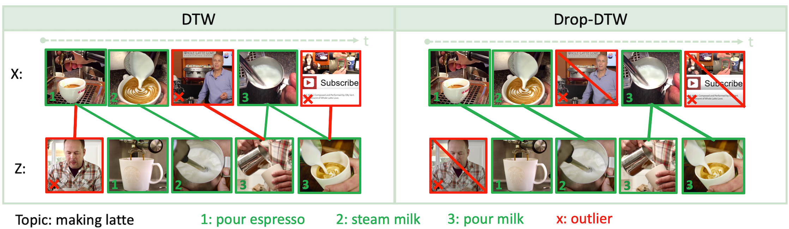

# Drop-DTW: Aligning Common Signal Between Sequences While Dropping Outliers

*[Nikita Dvornik](https://thoth.inrialpes.fr/people/mdvornik/)*<sup>1,2</sup>, 
*[Isma Hadji](http://www.cse.yorku.ca/~hadjisma/)*<sup>1</sup>, 
*[Konstantinos G. Derpanis](https://www.cs.ryerson.ca/kosta/)*<sup>1</sup>, 
*[Allan D. Jepson](https://www.cs.toronto.edu/~jepson/)*<sup>1</sup>,
and *[Animesh Garg](https://animesh.garg.tech/)*<sup>2</sup>

<sup>1</sup>Samsung AI Center (SAIC) - Toronto &nbsp;&nbsp;
<sup>2</sup>University of Toronto &nbsp;&nbsp;
* This research was conducted at SAIC-Toronto, funded by Samsung Research, and a provisional patent application has been filed.


#
<div align="center">
  
</div>

In this work, we consider the problem of sequence-to-sequence alignment for signals
containing outliers. Assuming the absence of outliers, the standard Dynamic
Time Warping (DTW) algorithm efficiently computes the optimal alignment between
two (generally) variable-length sequences. While DTW is robust to temporal
shifts and dilations of the signal, it fails to align sequences in a meaningful way
in the presence of outliers that can be arbitrarily interspersed in the sequences. To
address this problem, we introduce Drop-DTW, a novel algorithm that aligns the
common signal between the sequences while automatically dropping the outlier elements
from the matching. The entire procedure is implemented as a single dynamic
program that is efficient and fully differentiable. In our experiments, we show that
Drop-DTW is a robust similarity measure for sequence retrieval and demonstrate
its effectiveness as a training loss on diverse applications. With Drop-DTW, we
address temporal step localization on instructional videos, representation learning
from noisy videos, and cross-modal representation learning for audio-visual
retrieval and localization. In all applications, we take a weakly- or unsupervised
approach and demonstrate state-of-the-art results under these settings.

## Applications
The proposed alignment loss enables various downstream applications. Take a look at this video for examples.
[](https://youtu.be/)

## Code
This is the official PyTorch implementation of Drop-DTW [1] (published at NeurIPS'21). The code includes the core Drop-DTW algorithm as well as the step localization experiments on the COIN dataset [2].

## Set up the data
1. (a) Download pre-extracted features for the COIN dataset by running `download_coin_features.sh` in the root folder of the project. The features are extracted using the S3D net pretrained on HowTo100M [3];
OR
(b) If for some reason you do not want to use pre-extracted features but instead you want to extract the features yourself, please follow the instructions in `video_encoding/`. This step is performed *instead* of step 1a.
2. In the terminal where you are going to run training/testing, run the following command first:
    ```
    ulimit -n 5000
    ```
    This sets the number of simultaneously open files to 5000 which is important to make the data loader function properly.

## Train the network
In order to train a feature mapping with Drop-DTW loss (using 0.3 percentile drop-cost) run the following command:
```
python3 train.py --name=my_model --keep_percentile=0.3
```
Inspect `train.py` for possible additional training configurations, such as network architecture changes, learnable drop cost and many more.

## Step localization inference
To test your model's ability to do step localization on the COIN dataset, run the following code:
```
python3 evaluate.py --name=my_model
```
You can change the inference method from Drop-DTW to some other algorithms and alter other testing settings using flags. Please, refer to `evaluate.py` for more details.

## Citation
If you use this code or our models, please cite our paper:
```
@inproceedings{Drop-DTW,
  title={Drop-DTW: Aligning Common Signal Between Sequences While Dropping Outliers},
  author={Dvornik, Nikita and Hadji, Isma and Derpanis, Konstantinos G and Garg, Animesh and Jepson, Allan D},
  booktitle={NeurIPS},
  year={2021}
}
```
## References
[1] Dvornik et al. "Drop-DTW: Aligning Common Signal Between Sequences While Dropping Outliers." NeurIPS'21.

[2] Tang et al. "COIN: A Large-scale Dataset for Comprehensive Instructional Video Analysis." CVPR'19

[3] Miech et al. "End-to-end learning of visual representations from uncurated instructional videos." CVPR'20.
